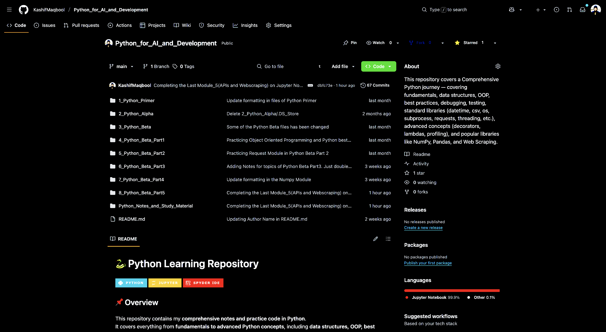

# 🐍 Python for Data Science and AI Development  
### *(Part of the Data Science Specialization)*  

Welcome to the **Python for Data Science and AI Development** the learning of this course, is a key part of my **Data Science Specialization**.  

This repository **serves** as a **reference and connection point** to my main **Python learning repository**, where I’ve covered **all fundamental and advanced Python concepts** — from basic syntax to Object-Oriented Programming (OOP), advanced modules, Testing, Debugging, Lambda Expressions, profiling, Numpy, Pandas, Beautiful soup,  and much more.  

---

## 🔗 Where to Learn Python Basics and Advanced Concepts

All the Python concepts that I have learned from this course, I've **merged** into my already created **dedicated Python repository**:  
👉 **[Python_for_AI_and_Development](https://github.com/KashifMaqbool/Python_for_AI_and_Development.git)**  

You can visit that repository to explore:  
- Python Fundamentals  
- Data Structures  
- Object-Oriented Programming (OOP)  
- List Comprehensions  
- File Handling  
- Web Scraping
- Profiling
- Decorators and Lambda Expressions
- Testing & Debugging, Threading and much more!  

This approach helps to **avoid duplication** and keeps all Python-related learning resources in one central place.  

---

## 🖼️ Repository Reference Screenshot

The repository **Python_for_AI_and_Development** is available on my same GitHub account:  

---

## 🧠 About This Course

This course focuses on **applying Python skills** to solve **Data Science and AI problems**.  
Here, you’ll learn how Python is used for:  
- Data Wrangling and Cleaning  
- Exploratory Data Analysis (EDA)  
- Data Visualization  

However, before diving into these applied topics, you’re encouraged to review the **Python_for_AI_and_Development topics** available in the linked repository.

---

## 🤝 Contributing

Contributions are always welcome! 🙌  

If you want to enhance this repository (add notebooks, visualizations, or improve explanations):  
1. **Fork** the repository  
2. **Create a branch** (`git checkout -b feature-branch`)  
3. **Commit** your changes (`git commit -m "Added new resource"`)  
4. **Push** your branch (`git push origin feature-branch`)  
5. **Open a Pull Request** 🚀  

---

## 📜 License

This repository is licensed under the **Creative Commons License (CC BY-NC 4.0)**.  
You are free to share and adapt the material with attribution, but **no commercial use** is allowed.  

🔗 [Read more about the license here](https://creativecommons.org/licenses/by-nc/4.0/)  

---

## 🙌 Author

**KASHIF MAQBOOL JOIYA**  
🎓 Data Scientist | AI Engineer  
💻 Passionate about Open Source, Data Science, Big Data, and AI Systems  

🌐 Connect with me:  
- [GitHub](https://github.com/KashifMaqbool)  
- [LinkedIn](https://www.linkedin.com/in/kashif-maqbool-joiya-390747209/)  

---
