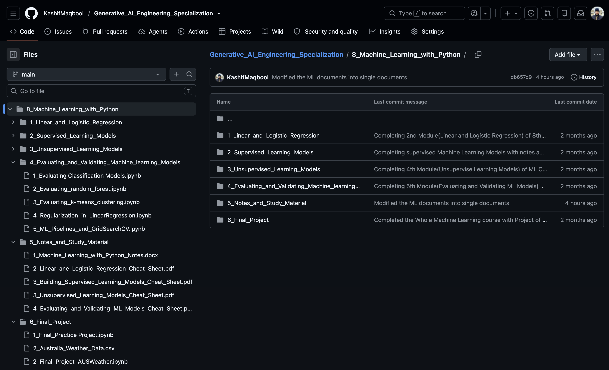

# 🤖 Machine Learning with Python

#### *(Part of the IBM Data Science Specialization)*

Welcome to the **Machine Learning with Python** repository, which is part of my **IBM Data Science Specialization**.

This repository serves as a **reference and connection point** to my dedicated **Machine Learning with Python** repository, which I originally completed as part of the **IBM Generative AI Engineering Specialization**.

Since the **same course** is included in both specializations, I have **consolidated all course materials into a single repository** to avoid duplication while keeping my GitHub portfolio organized and easy to navigate.

---

## 🔗 Complete Course Repository

All the learning resources, coding exercises, hands-on labs, projects, notes, and implementations from this course are available in my dedicated repository:

👉 **[Machine_Learning_with_Python](https://github.com/KashifMaqbool/Generative_AI_Engineering_Specialization/tree/main/8_Machine_Learning_with_Python)**

That repository contains everything covered throughout the course, including:

* Supervised Learning
* Unsupervised Learning
* Regression Models
* Classification Algorithms
* Clustering Techniques
* Dimensionality Reduction
* Model Training
* Model Evaluation
* Model Optimization
* Predictive Modeling
* Statistical Methods
* Python Programming
* Scikit-learn Implementations
* Hands-on Labs
* Coding Exercises
* Practice Projects
* Course Notes

This centralized approach allows all **Machine Learning** content to remain in one place while eliminating duplicate repositories across multiple IBM specializations.

---

## 🖼️ Repository Reference Screenshot

The complete **Machine_Learning_with_Python** repository is available on my same this GitHub account.

---

## 🧠 About This Course

This course introduces the core concepts of **Machine Learning** and demonstrates how intelligent models can be developed using **Python** and **Scikit-learn**.

Throughout the course, I learned how to:

* Explain the foundations of Machine Learning and the roles of supervised and unsupervised learning.
* Build regression, classification, clustering, and dimensionality reduction models.
* Train, evaluate, and optimize machine learning models using appropriate validation strategies and performance metrics.
* Develop complete end-to-end Machine Learning solutions on real-world datasets through practical labs and projects.

If you're interested in exploring the complete implementations, notebooks, and projects, please visit the linked repository above.

---

## 🤝 Contributing

Contributions are always welcome!

If you'd like to improve this repository or suggest enhancements:

1. Fork the repository.
2. Create a new branch (`git checkout -b feature-branch`).
3. Commit your changes (`git commit -m "Describe your changes"`).
4. Push your branch (`git push origin feature-branch`).
5. Open a Pull Request.

---

## 📜 License

This repository is licensed under the **Creative Commons Attribution-NonCommercial 4.0 International (CC BY-NC 4.0)** License.

You are free to share and adapt the material with proper attribution for **non-commercial purposes**.

Learn more:
https://creativecommons.org/licenses/by-nc/4.0/

---

## 🙌 Author

**KASHIF MAQBOOL JOIYA**

**Data Scientist | AI Engineer**

Passionate about Machine Learning, Artificial Intelligence, Data Science, Computer Vision, NLP, Robotics, and Open Source.

**Connect with me:**

* GitHub: https://github.com/KashifMaqbool
* LinkedIn: https://www.linkedin.com/in/kashif-maqbool-joiya-390747209/
